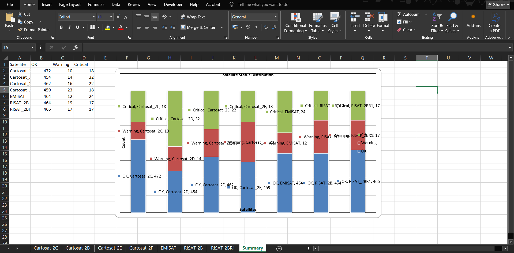
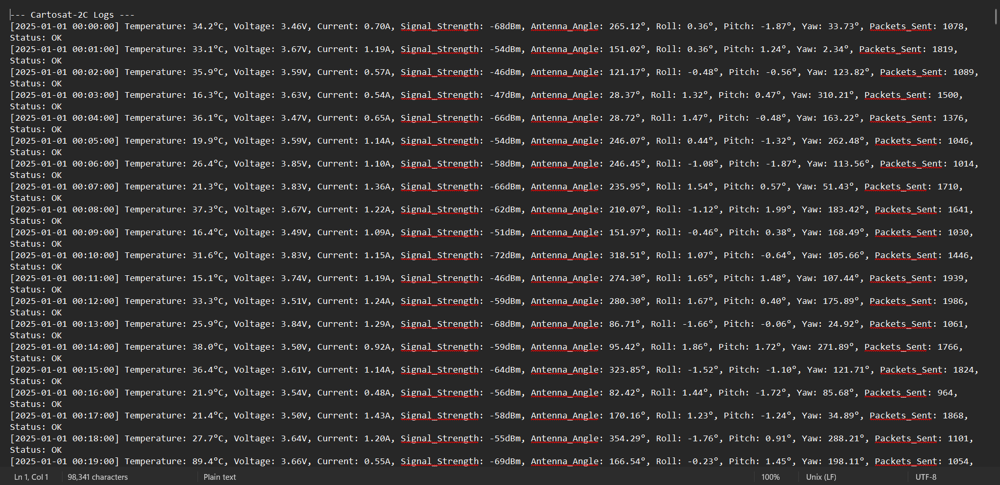

# 🚀 LEO Satellite Telemetry Dashboard

**Project Type:** Data Analytics / Python Automation  
**Domain:** Space / Satellite Monitoring  

---

## 📖 Project Overview

This project automates the monitoring and analysis of telemetry data from multiple Low Earth Orbit (LEO) satellites. Each satellite generates logs containing telemetry readings (`OK`, `Warning`, `Critical`) along with other metrics.  

The system parses, cleans, aggregates, and visualizes satellite telemetry in an **Excel-based dashboard** to provide real-time insights into satellite health and performance.

---

## 🛠 Problem Statement

Satellites produce enormous amounts of telemetry data, and manual monitoring is error-prone and time-consuming. This project aims to:

- Automatically parse satellite log files.
- Clean and structure telemetry data.
- Highlight critical or warning statuses.
- Generate a summary sheet with aggregated metrics.
- Visualize the status distribution across all satellites via stacked bar charts inside Excel.

**Goal:** Help engineers quickly identify potential issues in satellite operations, ensuring timely action and safer space missions.

---

## 📂 Project Workflow

1. **Log Parsing & Cleaning**  
   - Extract timestamp and telemetry parameters from log files.
   - Structure data into separate DataFrames for each satellite.

2. **Excel Report Generation**  
   - Create an Excel workbook with individual sheets for each satellite.
   - Apply conditional formatting to highlight warnings and critical readings.

3. **Summary Sheet Creation**  
   - Aggregate telemetry statuses (`OK`, `Warning`, `Critical`) per satellite.
   - Store results in a dedicated “Summary” sheet.

4. **Data Visualization**  
   - Embed stacked bar charts within Excel for visual analysis.
   - Charts display the distribution of statuses across satellites.

---

## 💻 Technologies & Libraries

- **Python 3.10+**
- **pandas** – Data cleaning & processing  
- **openpyxl** – Excel manipulation & chart creation  
- **matplotlib** – Optional external visualization  
- **re** – Log parsing using regular expressions  

---

## 📊 Sample Dashboard / Charts

### Stacked Bar Chart - Satellite Status Distribution


### Summary Sheet Example



> *Replace `images/...` with actual screenshots of your Excel output.*

---

## 🛠 How to Run

1. Clone the repository:  
   ```bash
   git clone https://github.com/username/LEO-Satellite-Telemetry.git
